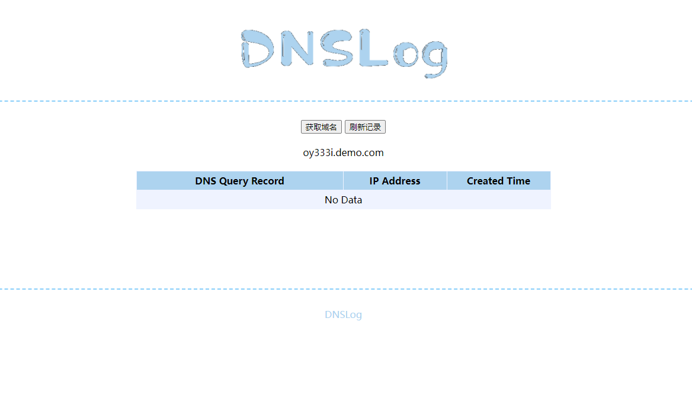

# DNSLOG
dnslog 优化

>源项目地址：https://github.com/lanyi1998/DNSlog-GO

最大程度还原dnslog.cn 的使用效果，致敬lanyi1998和dnslog.cn提供的经典项目。

同时复用了作者的多用户身份认证，增加了一个py小脚本用于生成随机token以满足团队使用，搭建部分就不废话了，大家可以去lanyi1998大佬的项目或者文章中学习。